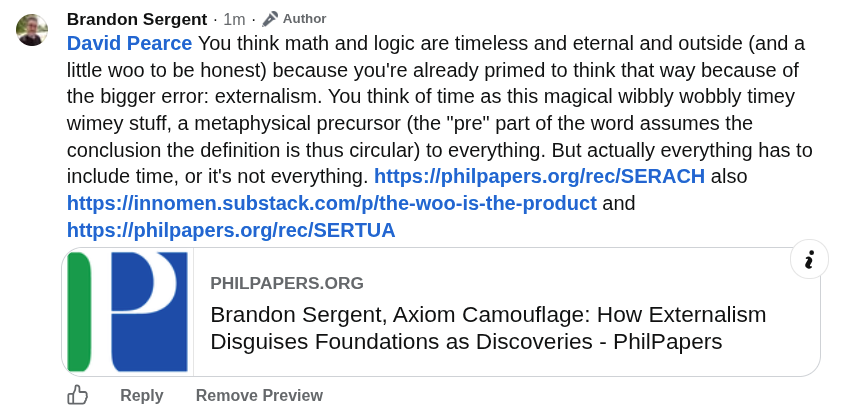

# EE Segment transcript

## Machine transcription

Brandon Sergent - 1m - /* Author

David Pearce You think math and logic are timeless and eternal and outside (and a
little woo to be honest) because you're already primed to think that way because of
the bigger error: externalism. You think of time as this magical wibbly wobbly timey
wimey stuff, a metaphysical precursor (the "pre" part of the word assumes the
conclusion the definition is thus circular) to everything. But actually everything has to
include time, or it's not everything. https:/lphilpapers.orglrec/SERACH also
https:/linnomen.substack.com/p/the-woo-is-the-product and
https'llphiIpapers.orglrecISERTUA

i
PHILPAPERS.ORG
Brandon Sergent, Axiom Camouflage: How Externalism
Disguises Foundations as Discoveries - PhilPapers

Reply  Remove Preview
