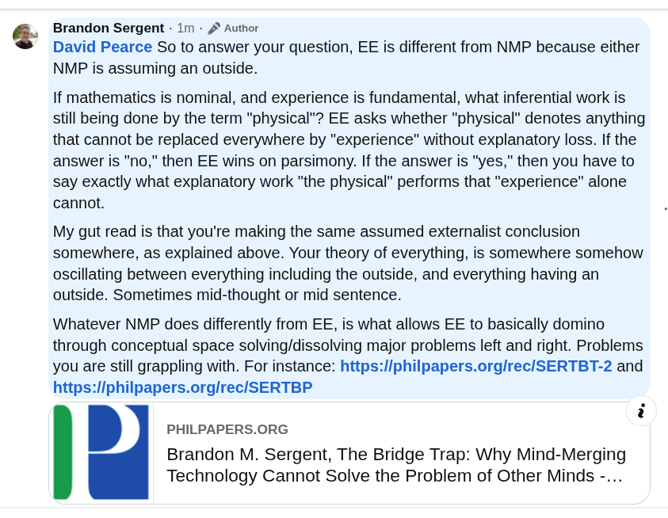

# EE Segment transcript

## Machine transcription

Brandon Sergent - 1m - 2 Author
David Pearce So to answer your question, EE is different from NMP because either
NMP is assuming an outside.

If mathematics is nominal, and experience is fundamental, what inferential work is
still being done by the term "physical"? EE asks whether "physical” denotes anything
that cannot be replaced everywhere by "experience" without explanatory loss. If the
answer is "no," then EE wins on parsimony. If the answer is "yes," then you have to
say exactly what explanatory work "the physical" performs that "experience" alone
cannot.

My gut read is that you're making the same assumed externalist conclusion
somewhere, as explained above. Your theory of everything, is somewhere somehow
oscillating between everything including the outside, and everything having an
outside. Sometimes mid-thought or mid sentence.

Whatever NMP does differently from EE, is what allows EE to basically domino
through conceptual space solving/dissolving major problems left and right. Problems
you are still grappling with. For instance: https://philpapers.orglrec/SERTBT-2 and
https:/Iphilpapers.org/rec/SERTBP

i
. PHILPAPERS.ORG
Brandon M. Sergent, The Bridge Trap: Why Mind-Merging
Technology Cannot Solve the Problem of Other Minds -...
