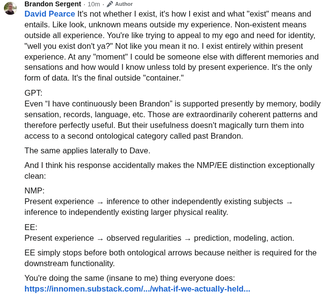

# EE Segment transcript

## Machine transcription

Brandon Sergent - 10m - 2* Author

David Pearce It's not whether | exist, it's how | exist and what "exist" means and
entails. Like look, unknown means outside my experience. Non-existent means
outside all experience. You're like trying to appeal to my ego and need for identity,
"well you exist don't ya?" Not like you mean it no. | exist entirely within present
experience. At any "moment’ | could be someone else with different memories and
sensations and how would | know unless told by present experience. Its the only
form of data. It's the final outside "container.”

GPT:
Even "I have continuously been Brandon” is supported presently by memory, bodily
sensation, records, language, etc. Those are extraordinarily coherent patterns and

therefore perfectly useful. But their usefulness doesn't magically turn them into
access to a second ontological category called past Brandon.

The same applies laterally to Dave

And | think his response accidentally makes the NMP/EE distinction exceptionally
clean:

NMP:

Present experience - inference to other independently existing subjects —
inference to independently existing larger physical reality.

EE:

Present experience - observed regularities — prediction, modeling, action.

EE simply stops before both ontological arrows because neither is required for the
downstream functionality.

You're doing the same (insane to me) thing everyone does:
https:/linnomen.substack.coml...;what-if-we-actually-held...
