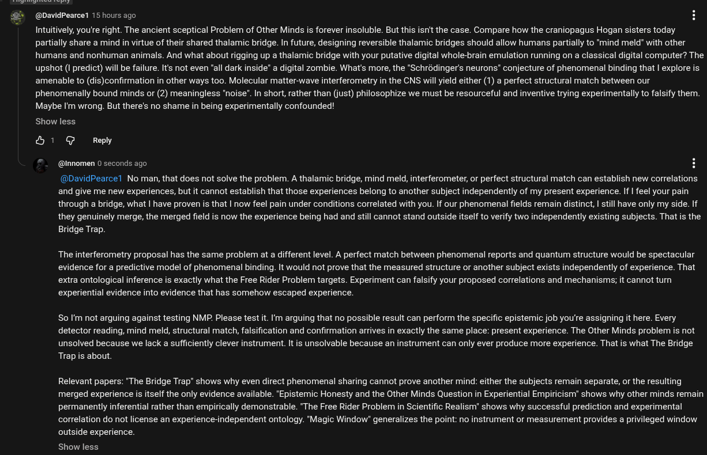

# EE Segment transcript

## Machine transcription

(@DavidPearce1 15 hours ago

Intuitively, you're right. The ancient sceptical Problem of Other Minds is forever insoluble. But this isn't the case. Compare how the craniopagus Hogan sisters today
partially share a mind in virtue of their shared thalamic bridge. In future, designing reversible thalamic bridges should allow humans partially to “mind meld" with other
humans and nonhuman animals. And what about rigging up a thalamic bridge with your putative digital whole-brain emulation running on a classical digital computer? The
upshot (I predict) will be failure. It's not even "all dark inside" a digital zombie. What's more, the *Schrédinger's neurons® conjecture of phenomenal binding that | explore is
amenable to (dis)confirmation in other ways too. Molecular matter-wave interferometry in the CNS will yield either (1) a perfect structural match between our
phenomenally bound minds or (2) meaningless "noise". In short, rather than (just) philosophize we must be resourceful and inventive trying experimentally to falsify them.
Maybe I'm wrong. But there's no shame in being experimentally confounded!

Show less
H 1 G Reply
“_ @Innomen 0 seconds ago H

@DavidPearcel No man, that does not solve the problem. A thalamic bridge, mind meld, interferometer, or perfect structural match can establish new correlations
and give me new experiences, but it cannot establish that those experiences belong to another subject independently of my present experience. If | feel your pain
through a bridge, what | have proven is that | now feel pain under conditions correlated with you. If our phenomenal fields remain distinct, | still have only my side. If
they genuinely merge, the merged field is now the experience being had and still cannot stand outside itself to verify two independently existing subjects. That s the
Bridge Trap.

The interferometry proposal has the same problem at a different level. A perfect match between phenomenal reports and quantum structure would be spectacular
evidence for a predictive model of phenomenal binding. It would not prove that the measured structure or another subject exists independently of experience. That
extra ontological inference is exactly what the Free Rider Problem targets. Experiment can falsify your proposed correlations and mechanisms; it cannot turm
experiential evidence into evidence that has somehow escaped experience.

So I'm not arguing against testing NMP. Please test t. I'm arguing that no possible result can perform the specific epistemic job you're assigning it here. Every
detector reading, mind meld, structural match, falsification and confirmation arrives in exactly the same place: present experience. The Other Minds problem is not
unsolved because we lack a sufficiently clever instrument. It is unsolvable because an instrument can only ever produce more experience. That is what The Bridge
Trap is about.

Relevant papers: 'The Bridge Trap" shows why even direct phenomenal sharing cannot prove another mind: either the subjects remain separate, or the resulting
merged experience is itself the only evidence available. "Epistemic Honesty and the Other Minds Question in Experiential Empiricism" shows why other minds remain
permanently inferential rather than empirically demonstrable. “The Free Rider Problem in Scientific Realism" shows why successful prediction and experimental
correlation do not license an experience-independent ontology. "Magic Window" generalizes the point: no instrument or measurement provides a privileged window
outside experience.

Show less
