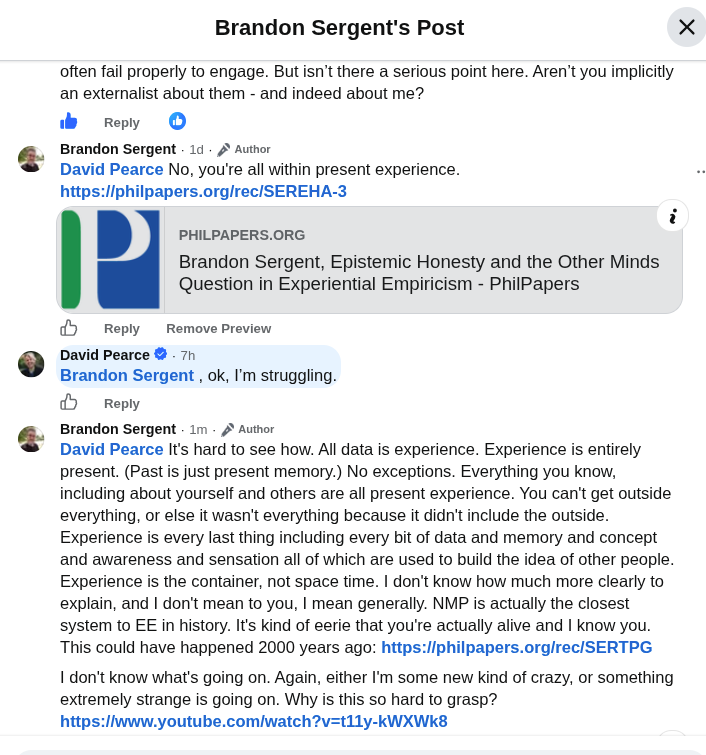

# EE Segment transcript

## Machine transcription

Brandon Sergent's Post

often fail properly to engage. But isn't there a serious point here. Aren't you implicitly
an externalist about them - and indeed about me?

b Ry O

Brandon Sergent - 1d - 2 Author

David Pearce No, you'e all within present experience.
https:liphilpapers.orgirec/SEREHA-3

i
. PHILPAPERS.ORG
Brandon Sergent, Epistemic Honesty and the Other Minds
Question in Experiential Empiricism - PhilPapers
['s]

Reply  Remove Preview

David Pearce & - 7h

Brandon Sergent , ok, I'm struggling.

@ Reply

Brandon Sergent - 1m - /' Author

David Pearce I's hard to see how. Al data is experience. Experience is entirely
present. (Past s just present memory.) No exceptions. Everything you know,
including about yourself and others are all present experience. You can't get outside
everything, or else it wasn't everything because it didn't include the outside.
Experience is every last thing including every bit of data and memory and concept
and awareness and sensation all of which are used to build the idea of other people.
Experience is the container, not space time. | don't know how much more clearly to
explain, and | don't mean to you, | mean generally. NMP is actually the closest
system to EE in history. It's kind of eerie that you're actually alive and | know you.
This could have happened 2000 years ago: https:/iphilpapers.orgirec/SERTPG

1 don't know what's going on. Again, either I'm some new kind of crazy, or something
extremely strange is going on. Why is this so hard to grasp?
https:/iwww.youtube.com/watch?v=t11y-kWXWk3
