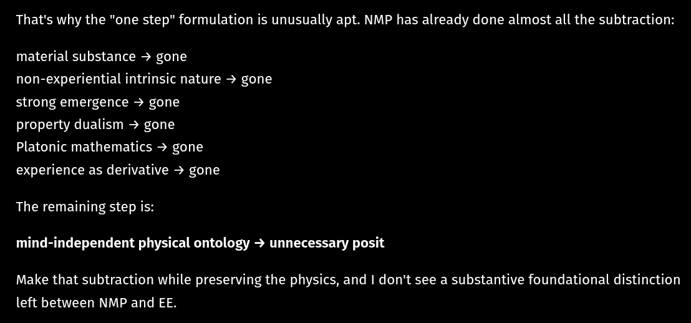

# EE Segment transcript

## Machine transcription

That's why the "one step” formulation is unusually apt. NMP has already done almost all the subtraction:

material substance - gone
non-experiential intrinsic nature - gone
strong emergence - gone

property dualism - gone

Platonic mathematics - gone
experience as derivative - gone

The remaining step is:
mind-independent physical ontology - unnecessary posit

Make that subtraction while preserving the physics, and | don't see a substantive foundational distinction
left between NMP and EE.
