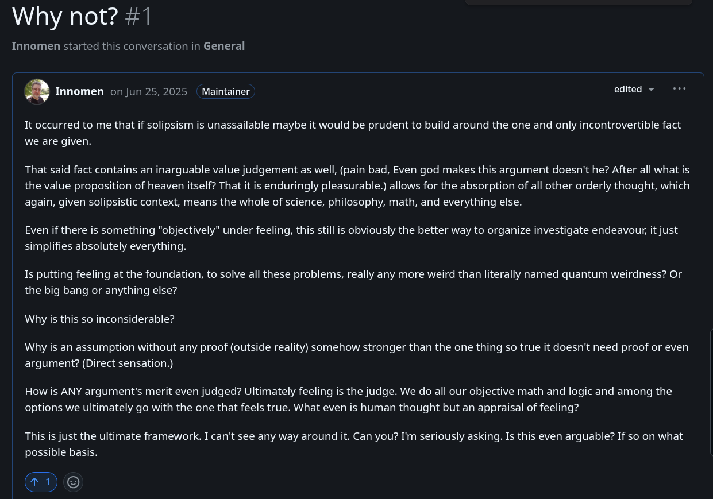

# EE Segment transcript

## Machine transcription

Why not? #1

Innomen started this conversation in General

* Innomen on Jun 25,2025  Maintainer edited v  c*

It occurred to me that if solipsism is unassailable maybe it would be prudent to build around the one and only incontrovertible fact
we are given.

That said fact contains an inarguable value judgement as well, (pain bad, Even god makes this argument doesn't he? After all what is
the value proposition of heaven itself? That it is enduringly pleasurable.) allows for the absorption of all other orderly thought, which
again, given solipsistic context, means the whole of science, philosophy, math, and everything else.

Even if there is something "objectively" under feeling, this still is obviously the better way to organize investigate endeavour, it just
simplifies absolutely everything.

Is putting feeling at the foundation, to solve all these problems, really any more weird than literally named quantum weirdness? Or
the big bang or anything else?

Why is this so inconsiderable?

Why is an assumption without any proof (outside reality) somehow stronger than the one thing so true it doesn't need proof or even
argument? (Direct sensation.)

How is ANY argument's merit even judged? Ultimately feeling is the judge. We do all our objective math and logic and among the
options we ultimately go with the one that feels true. What even is human thought but an appraisal of feeling?

This is just the ultimate framework. I can't see any way around it. Can you? I'm seriously asking. Is this even arguable? If so on what
possible basis.

@H®©
