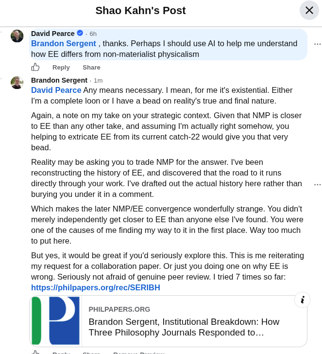

# EE Segment transcript

## Machine transcription

¢

Shao Kahn's Post

David Pearce & - 6h
Brandon Sergent , thanks. Perhaps | should use Al to help me understand
how EE differs from non-materialist physicalism

@9 Reply  share
Brandon Sergent - 1m

David Pearce Any means necessary. | mean, for me it's existential. Either
I'm a complete loon or | have a bead on reality's true and final nature.

Again, a note on my take on your strategic context. Given that NMP is closer
to EE than any other take, and assuming I'm actually right somehow, you
helping to extricate EE from its current catch-22 would give you that very
bead.

Reality may be asking you to trade NMP for the answer. I've been
reconstructing the history of EE, and discovered that the road to it runs
directly through your work. I've drafted out the actual history here rather than
burying you under it in a comment.

Which makes the later NMP/EE convergence wonderfully strange. You didn't
merely independently get closer to EE than anyone else I've found. You were
one of the causes of me finding my way to it in the first place. Way too much
to put here.

But yes, it would be great if you'd seriously explore this. This is me reiterating
my request for a collaboration paper. O just you doing one on why EE is
wrong. Seriously not afraid of genuine peer review. | tried 7 times so far:
hnps'llphilpapers orglrec/SERIBH

i
PHILPAPERS.ORG
Brandon Sergent, Institutional Breakdown: How
Three Philosophy Journals Responded to..
