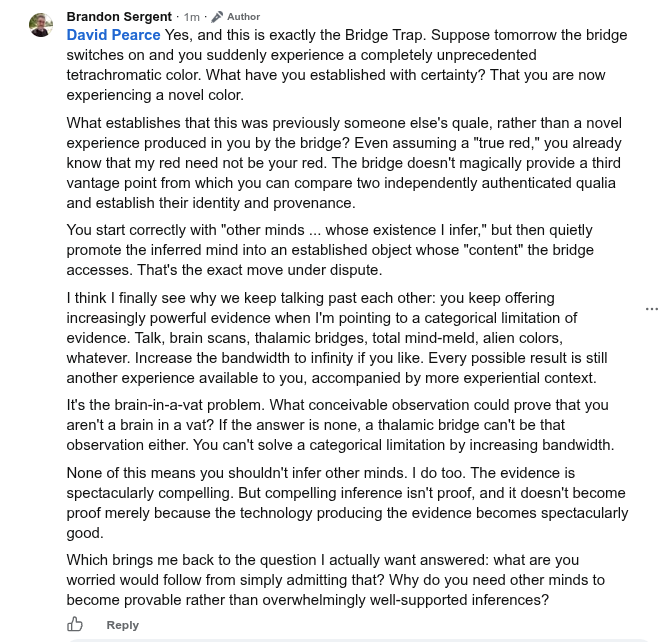

# EE Segment transcript

## Machine transcription

Brandon Sergent - 1m - 4* Autrer
David Pearce Yes, and this is exactly the Bridge Trap. Suppose tomorrow the bridge
switches on and you suddenly experience a completely unprecedented
tetrachromatic color. What have you established with certainty? That you are now
experiencing a novel color.

What establishes that this was previously someone else's quale, rather than a novel
experience produced in you by the bridge? Even assuming a "true red,” you already
know that my red need not be your red. The bridge doesn't magically provide a third
vantage point from which you can compare two independently authenticated qualia
and establish their identity and provenance.

You start correctly with "other minds ... whose existence | infer," but then quietly
promote the inferred mind into an established object whose "content” the bridge
accesses. That's the exact move under dispute.

I think | finally see why we keep talking past each other: you keep offering
increasingly powerful evidence when 'm pointing to a categorical limitation of
evidence. Talk, brain scans, thalamic bridges, total mind-meld, alien colors,
whatever. Increase the bandwidth to infinity if you like. Every possible result s stil
another experience available to you, accompanied by more experiential context.

It's the brain-in-a-vat problem. What conceivable observation could prove that you
aren'ta brain in a vat? If the answer is none, a thalamic bridge can't be that
observation either. You can't solve a categorical limitation by increasing bandwidth.

None of this means you shouldn't infer other minds. | do too. The evidence is
spectacularly compelling. But compelling inference isn't proof, and it doesn't become
proof merely because the technology producing the evidence becomes spectacularly
good.

Which brings me back to the question | actually want answered: what are you
worried would follow from simply admitting that? Why do you need other minds to
become provable rather than overwhelmingly well-supported inferences?

9 Reply
