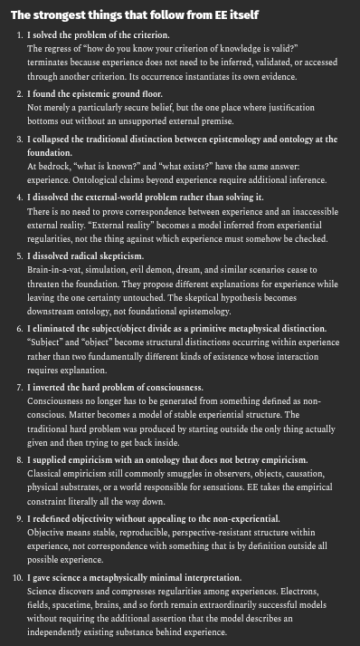

# EE Segment transcript

## Machine transcription

‘The strongest things that follow from EE itself
1. tsaved the problem of he ertrion,
“The regres of“how doyou knaw your rterion o knwledge i vlid?”
terminate becauseexperienc doe not ned 0 beinfered, validted, o accsssed

found theepisemic ground floor.
Not merlya pariclarly secure bele,but the on place wherefustifiction
Bottoms outwithoutan unsupportedexternal premise.

L collpscd the tradiions disinction betwecn cpistemology and ontalogy at the
foundat

Atbedrock, "wht i known?” and “whatexists?” have th same snwer:
esperince, Ontlogical s beyond expeiencerequiresditionl inference.

dissolved the external-word problem raher than solving .
There s o nee 1o prov corespondence becween exprience and an incessible
external ealiy.“Externlralty” becomes  model inered rom experintial
rogulaiie,not thething aganstwhich experience must somehow be checked.
disslved adicl skepticism,

Bran-in--vat, simlaton, il demon, dream,andsimilae scenaioscease o
threaten the foundaton. They proposediffrentexplanations forexpeience while
leaving th onecertanty unouched.The skeptical hypothesis becomes
dowastseam onology, ot foundational epistemolog:

1 liminated the subjecobect divide s  primicive metaphysicaldistnction.
“Sublec” nd “objsct”become strctursl distincrions occuring within expeience
ratherthan two fundamentaly diffrent kinds of existence whose iteraction
fp———

inverted the hard problem o conscousness
‘Consciousness o longerhas t b generatd fom something defined a5 non-
conscious. Matter becomes a model ofsable experintial strucure. The
teaditionalhard problem wasprodsced bysaringoutsde he only thing actuslly
givenand then tyng o gt back nside.

L supplicd empiricism wih an ntology thatdocs ot betzay empiricism.
Classcal empircis il commonly smaglesinobservers,abects, caustion,
physical substrte, o a world responsibl forsensations. E taks he empirical
constrain lterally al ch vy dow.

redefined objeciviey without appelin (0 the non-expercatial
Objective meansssbl,reproducibl,perspctive-resistant trcture within

esperience,not corespondence vith someching that s by defnition autside sl
possibl exprience.

10,1 gave sicnce a metaphysically minimal interpretaion.
Science discovers and comprsses regulrites among experences. lectrons,
field,spacetime,brsins, and so forth reman extraodinarly sccesefl models
‘without requiing theaddiional asseton that the modeldescribes an
independently eisting subsance behind experence.
