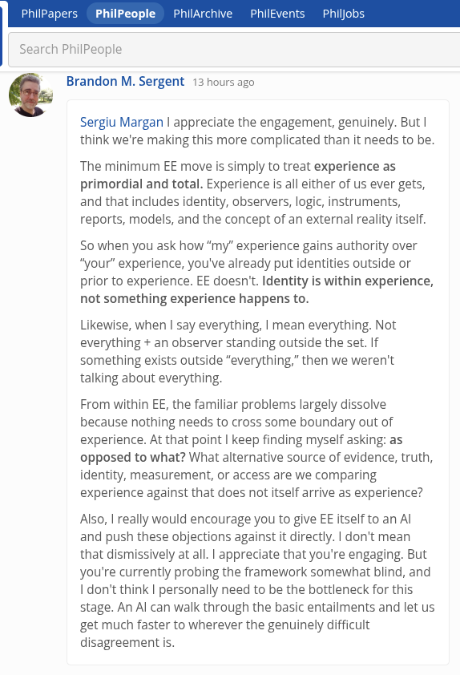

# EE Segment transcript

## Machine transcription

PhilPa PhilPeople  PhilAr

Search PhilPeople

Q Brandon M. Sergent 13 hours ago

Sergiu Margan | appreciate the engagement, genuinely. But |
think we're making this more complicated than it needs to be.

The minimum EE move is simply to treat experience as
primordial and total. Experience is all either of us ever gets,
and that includes identity, observers, logic, instruments,

reports, models, and the concept of an external reality itself.

S0 when you ask how “my” experience gains authority over
“your" experience, you've already put identities outside or
prior to experience. EE doesn'. Identity is within experience,
not something experience happens to.

Likewise, when | say everything, | mean everything. Not
everything + an observer standing outside the set. If
something exists outside “everything,” then we weren't
talking about everything,

From within EE, the familiar problems largely dissolve
because nothing needs to cross some boundary out of
experience. At that point | keep finding myself asking: as
opposed to what? What alternative source of evidence, truth,
identity, measurement, or access are we comparing
experience against that does not itself arrive as experience?

Also, | really would encourage you to give EE itself to an Al
and push these objections against it directly. | don't mean
that dismissively at all. | appreciate that you're engaging. But
you're currently probing the framework somewhat blind, and
Idon't think | personally need to be the bottleneck for this
stage. An Al can walk through the basic entailments and let us
get much faster to wherever the genuinely difficult
disagreement is.
