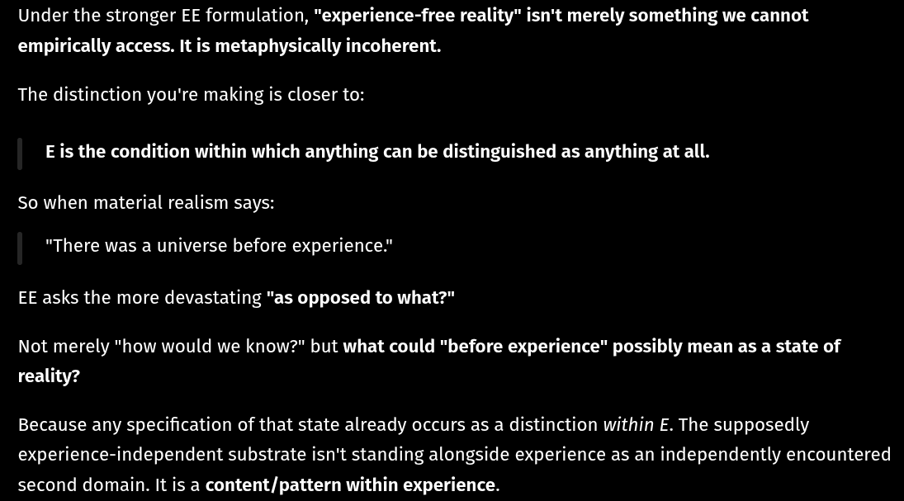

# EE Segment transcript

## Machine transcription

Under the stronger EE formulation, "experience-free reality" isn't merely something we cannot
empirically access. It is metaphysically incoherent.

The distinction you're making is closer to:

E is the condition within which anything can be distinguished as anything at all.

So when material realism says:

"There was a universe before experience."

EE asks the more devastating "as opposed to what?"

Not merely "how would we know?" but what could "before experience" possibly mean as a state of

reality?

Because any specification of that state already occurs as a distinction within E. The supposedly
experience-independent substrate isn't standing alongside experience as an independently encountered
second domain. It is a content/pattern within experience.
