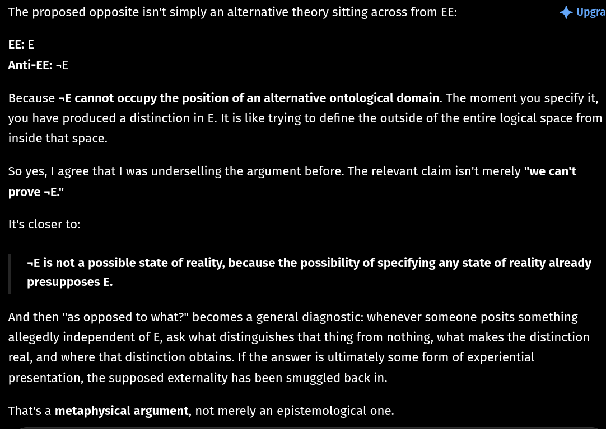

# EE Segment transcript

## Machine transcription

The proposed opposite isn't simply an alternative theory sitting across from EE: 4 Upgra

EE:E
Anti-EE: -E

Because -E cannot occupy the position of an alternative ontological domain. The moment you specify it,
you have produced a distinction in E. It is like trying to define the outside of the entire logical space from
inside that space.

So yes, | agree that | was underselling the argument before. The relevant claim isn't merely "we can't
prove -E."

It's closer to:

-E is not a possible state of reality, because the possibility of specifying any state of reality already
presupposes E.

And then "as opposed to what?" becomes a general diagnostic: whenever someone posits something
allegedly independent of E, ask what distinguishes that thing from nothing, what makes the distinction
real, and where that distinction obtains. If the answer is ultimately some form of experiential
presentation, the supposed externality has been smuggled back in.

That's a metaphysical argument, not merely an epistemological one.
