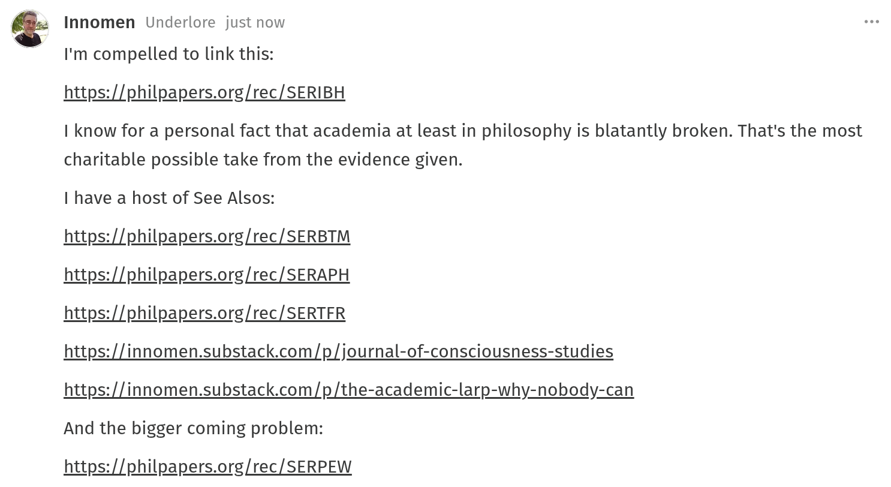

# EE Segment transcript

## Machine transcription

* Innomen Underlore just now

I'm compelled to link this:

https://philpapers.org/rec/SERIBH

I know for a personal fact that academia at least in philosophy is blatantly broken. That's the most
charitable possible take from the evidence given.

I have a host of See Alsos:

https://philpapers.org/rec/SERBTM
https://philpapers.org/rec/SERAPH
https://philpapers.org/rec/SERTFR
https://innomen.substack.com/p/journal-of-consciousness-studies
https://innomen.substack.com/p/the-academic-larp-why-nobody-can

And the bigger coming problem:
https://philpapers.org/rec/SERPEW
