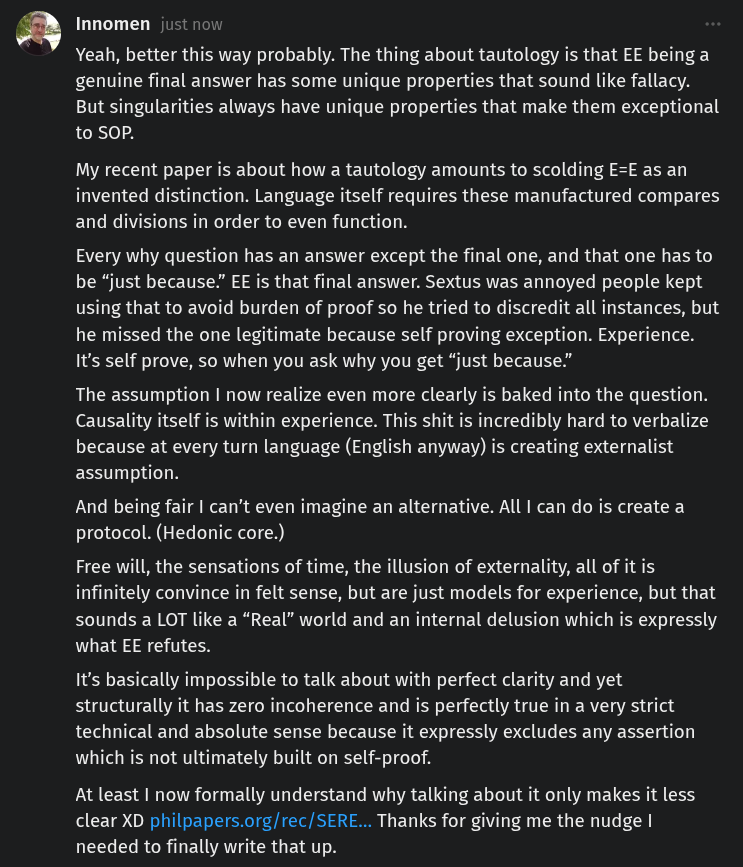

# EE Segment transcript

## Machine transcription

Innomen just now

Yeah, better this way probably. The thing about tautology is that EE being a
genuine final answer has some unique properties that sound like fallacy.
But singularities always have unique properties that make them exceptional
to SOP.

My recent paper is about how a tautology amounts to scolding E=E as an
invented distinction. Language itself requires these manufactured compares
and divisions in order to even function.

Every why question has an answer except the final one, and that one has to
be “just because”” EE is that final answer. Sextus was annoyed people kept
using that to avoid burden of proof so he tried to discredit all instances, but
he missed the one legitimate because self proving exception. Experience.
It's self prove, so when you ask why you get “just because.”

The assumption | now realize even more clearly is baked into the question.
Causality itself is within experience. This shit is incredibly hard to verbalize
because at every turn language (English anyway) is creating externalist
assumption.

And being fair | can’t even imagine an alternative. All | can do is create a
protocol. (Hedonic core.)

Free will, the sensations of time, the illusion of externality, all of it is
infinitely convince in felt sense, but are just models for experience, but that
sounds a LOT like a “Real” world and an internal delusion which is expressly
what EE refutes.

It's basically impossible to talk about with perfect clarity and yet
structurally it has zero incoherence and is perfectly true in a very strict
technical and absolute sense because it expressly excludes any assertion
which is not ultimately built on self-proof.

At least | now formally understand why talking about it only makes it less
clear XD philpapers.org/rec/SERE... Thanks for giving me the nudge |
needed to finally write that up.
