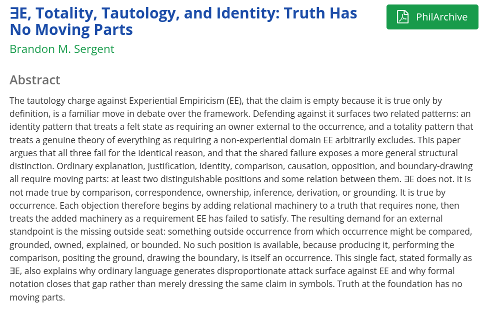

# EE Segment transcript

## Machine transcription

3E, Totality, Tautology, and Identity: Truth Has
No Moving Parts

Brandon M. Sergent

Abstract

The tautology charge against Experiential Empiricism (EE), that the claim is empty because it is true only by
definition, is a familiar move in debate over the framework. Defending against it surfaces two related patterns: an
identity pattern that treats a felt state as requiring an owner external to the occurrence, and a totality pattern that
treats a genuine theory of everything as requiring a non-experiential domain EE arbitrarily excludes. This paper
argues that all three fail for the identical reason, and that the shared failure exposes a more general structural
distinction. Ordinary explanation, justification, identity, comparison, causation, opposition, and boundary-drawing
all require moving parts: at least two distinguishable positions and some relation between them. 3E does not. It is
not made true by comparison, correspondence, ownership, inference, derivation, or grounding. It is true by
occurrence. Each objection therefore begins by adding relational machinery to a truth that requires none, then
treats the added machinery as a requirement EE has failed to satisfy. The resulting demand for an external
standpoint is the missing outside seat: something outside occurrence from which occurrence might be compared,
grounded, owned, explained, or bounded. No such position is available, because producing it, performing the
comparison, positing the ground, drawing the boundary, is itself an occurrence. This single fact, stated formally as
3E, also explains why ordinary language generates disproportionate attack surface against EE and why formal
notation closes that gap rather than merely dressing the same claim in symbols. Truth at the foundation has no
moving parts.
