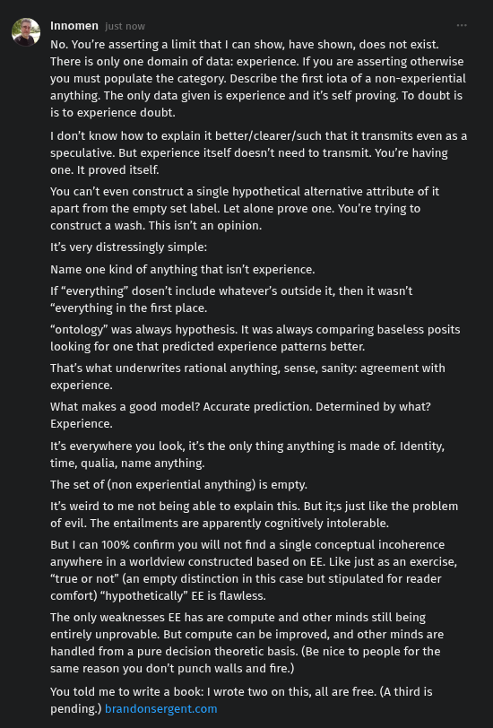

# EE Segment transcript

## Machine transcription

Innomen < 1
No. You're asserting a limit that | can show, have shown, does not exist.
There s only one domain of data: experience. If you are asserting otherwise
you must populate the category. Describe the first iota of a non-experiential
anything. The only data given is experience and it's self proving. To doubt is
i to experience doubt.

I don't know how to explain it better/clearer/such that it transmits even as a
speculative. But experience itself doesn't need to transmit. You're having
one. It proved itself.

You can't even construct a single hypothetical alternative attribute of it
apart from the empty set label. Let alone prove one. You're trying to
construct a wash. This isn't an opinion.

Its very distressingly simple:
Name one kind of anything that isn't experience.

If "everything” dosen't include whatever's outside it, then it wasn't
“everything in the first place.

“ontology” was always hypothesis. It was always comparing baseless posits
looking for one that predicted experience patterns better.

That's what underwrites rational anything, sense, sanity: agreement with
experience.

What makes a good model? Accurate prediction. Determined by what?
Experience.

It's everywhere you look, it’s the only thing anything is made of. Identity,
time, qualia, name anything.

The set of (non experiential anything) is empty.
Its weird to me not being able to explain this. But t;s just like the problem

of evil. The entailments are apparently cognitively intolerable.

But | can 100% confirm you will not find a single conceptual incoherence
‘anywhere in a worldview constructed based on EE. Like just as an exercise,
“true or not” (an empty distinction in this case but stipulated for reader
comfort) "hypothetically” EE is flawless.

The only weaknesses EE has are compute and other minds still being
entirely unprovable. But compute can be improved, and other minds are
handled from a pure decision theoretic basis. (Be nice to people for the
same reason you don't punch walls and fire.)

You told me to write a book: | wrote two on ths, all are free. (A third is
pending) brandonsergent.com
