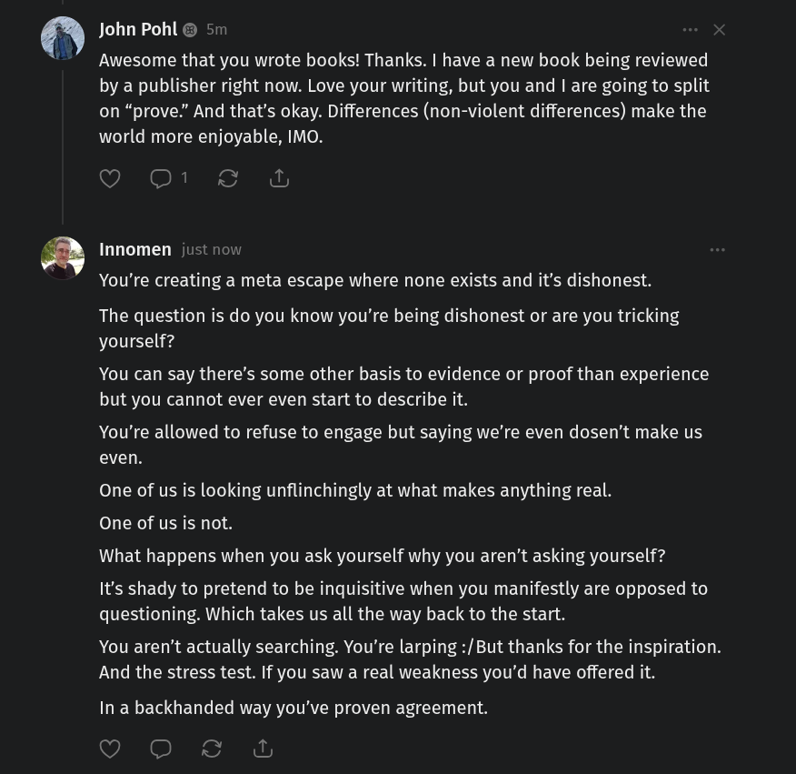

# EE Segment transcript

## Machine transcription

)

John Pohl & 5m

Awesome that you wrote books! Thanks. | have a new book being reviewed
by a publisher right now. Love your writing, but you and | are going to split
on “prove.” And that’s okay. Differences (non-violent differences) make the
world more enjoyable, IMO.

O 01 & &

Innomen just now

You're creating a meta escape where none exists and it's dishonest.

The question is do you know you're being dishonest or are you tricking
yourself?

You can say there’s some other basis to evidence or proof than experience
but you cannot ever even start to describe it.

You're allowed to refuse to engage but saying we're even dosen’t make us
even.

One of us is looking unflinchingly at what makes anything real.
One of us is not.
What happens when you ask yourself why you aren’t asking yourself?

It's shady to pretend to be inquisitive when you manifestly are opposed to
questioning. Which takes us all the way back to the start.

You aren't actually searching. You're larping :/But thanks for the inspiration.
And the stress test. If you saw a real weakness you'd have offered it.

In a backhanded way you've proven agreement.

(VR GIE & A
