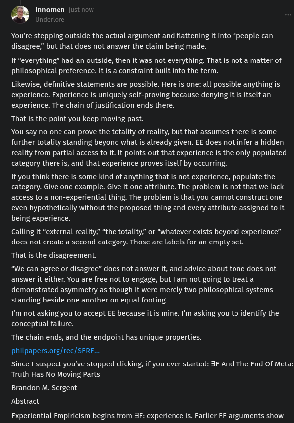

# EE Segment transcript

## Machine transcription

Innomen just

erlore

You're stepping outside the actual argument and flattening it into “people can
disagree;” but that does not answer the claim being made.

If “everything” had an outside, then it was not everything. That is not a matter of
philosophical preference. It is a constraint built into the term.

Likewise, definitive statements are possible. Here is one: all possible anything is
experience. Experience is uniquely self-proving because denying it is itself an
experience. The chain of justification ends there.

That is the point you keep moving past.

You say no one can prove the totality of reality, but that assumes there is some
further totality standing beyond what is already given. EE does not infer a hidden
reality from partial access to it. It points out that experience is the only populated
category there is, and that experience proves itself by occurring.

If you think there is some kind of anything that is not experience, populate the
category. Give one example. Give it one attribute. The problem is not that we lack
access to a non-experiential thing. The problem is that you cannot construct one
even hypothetically without the proposed thing and every attribute assigned to it
being experience.

Calling it “external reality,” “the totality,” or “whatever exists beyond experience”
does not create a second category. Those are labels for an empty set.

That is the disagreement.

“We can agree or disagree” does not answer it, and advice about tone does not
answer it either. You are free not to engage, but | am not going to treat a
demonstrated asymmetry as though it were merely two philosophical systems
standing beside one another on equal footing.

I'm not asking you to accept EE because it is mine. I'm asking you to identify the
conceptual failure.

The chain ends, and the endpoint has unique properties.
philpapers.org/rec/SERE.

since I suspect you've stopped clicking, if you ever started: 3 And The End Of Meta:
Truth Has No Moving Parts

Brandon M. Sergent
Abstract

Experiential Empiricism begins from JE: experience is. Earlier EE arguments show
