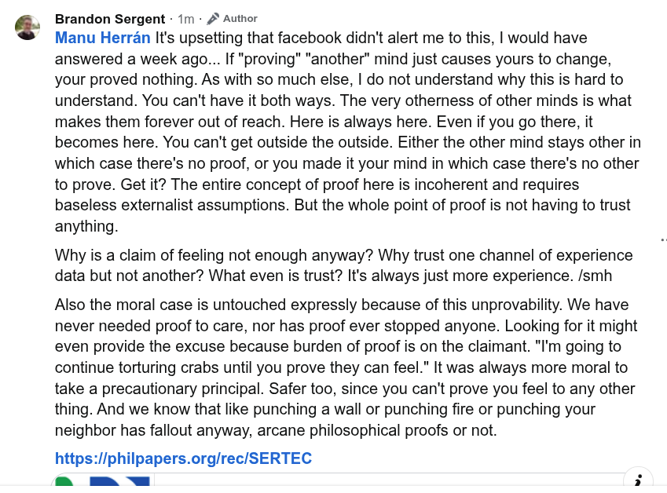

# EE Segment transcript

## Machine transcription

Brandon Sergent - 1m - 2 Author

Manu Herran It's upsetting that facebook didn't alert me to this, | would have
answered a week ago... If "proving" "another" mind just causes yours to change,
your proved nothing. As with so much else, | do not understand why this is hard to
understand. You can't have it both ways. The very otherness of other minds is what
makes them forever out of reach. Here is always here. Even if you go there, it
becomes here. You can't get outside the outside. Either the other mind stays other in
which case there's no proof, or you made it your mind in which case there's no other
to prove. Get it? The entire concept of proof here is incoherent and requires
baseless externalist assumptions. But the whole point of proof is not having to trust

anything.

Why is a claim of feeling not enough anyway? Why trust one channel of experience
data but not another? What even is trust? It's always just more experience. /smh

Also the moral case is untouched expressly because of this unprovability. We have
never needed proof to care, nor has proof ever stopped anyone. Looking for it might
even provide the excuse because burden of proof is on the claimant. "I'm going to
continue torturing crabs until you prove they can feel." It was always more moral to
take a precautionary principle. Safer too, since you can't prove you feel to any other
thing. And we know that like punching a wall or punching fire or punching your
neighbor has fallout anyway, arcane philosophical proofs or not.

https://philpapers.org/rec/SERTEC
d9 Reply Edited
