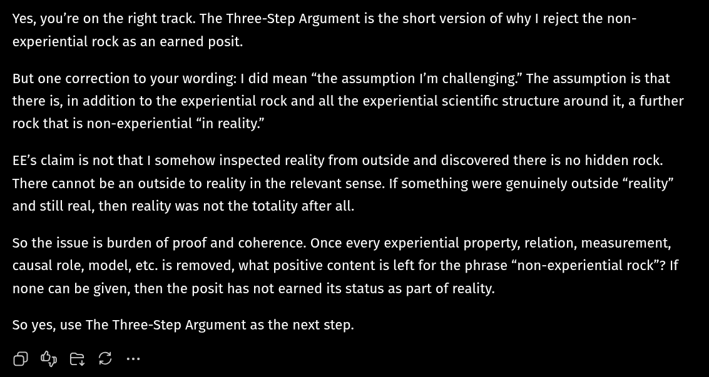

# EE Segment transcript

## Machine transcription

Yes, you're on the right track. The Three-Step Argument is the short version of why | reject the non-
experiential rock as an earned posit.

But one correction to your wording: | did mean “the assumption I'm challenging” The assumption is that
there is, in addition to the experiential rock and all the experiential scientific structure around it, a further
rock that is non-experiential “in reality.”

EE’s claim is not that | somehow inspected reality from outside and discovered there is no hidden rock.
There cannot be an outside to reality in the relevant sense. If something were genuinely outside “reality”
and still real, then reality was not the totality after all.

So the issue is burden of proof and coherence. Once every experiential property, relation, measurement,
causal role, model, etc. is removed, what positive content is left for the phrase “non-experiential rock”? If
none can be given, then the posit has not earned its status as part of reality.

So yes, use The Three-Step Argument as the next step.

098 C
