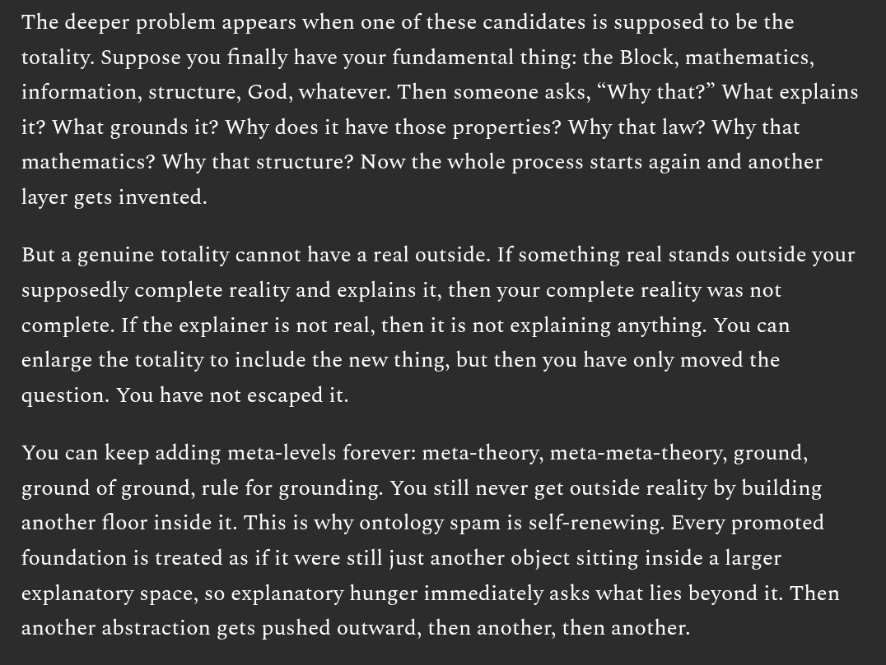

# EE Segment transcript

## Machine transcription

The deeper problem appears when one of these candidates is supposed to be the
totality. Suppose you finally have your fundamental thing: the Block, mathematics,
information, structure, God, whatever. Then someone asks, “Why that?” What explains
it? What grounds it? Why does it have those properties? Why that law? Why that
mathematics? Why that structure? Now the whole process starts again and another

layer gets invented.

But a genuine totality cannot have a real outside. If something real stands outside your
supposedly complete reality and explains it, then your complete reality was not
complete. If the explainer is not real, then it is not explaining anything. You can
enlarge the totality to include the new thing, but then you have only moved the

question. You have not escaped it.

You can keep adding meta-levels forever: meta-theory, meta-meta-theory, ground,
ground of ground, rule for grounding. You still never get outside reality by building
another floor inside it. This is why ontology spam is self-renewing. Every promoted
foundation is treated as if it were still just another object sitting inside a larger
explanatory space, so explanatory hunger immediately asks what lies beyond it. Then

another abstraction gets pushed outward, then another, then another.
