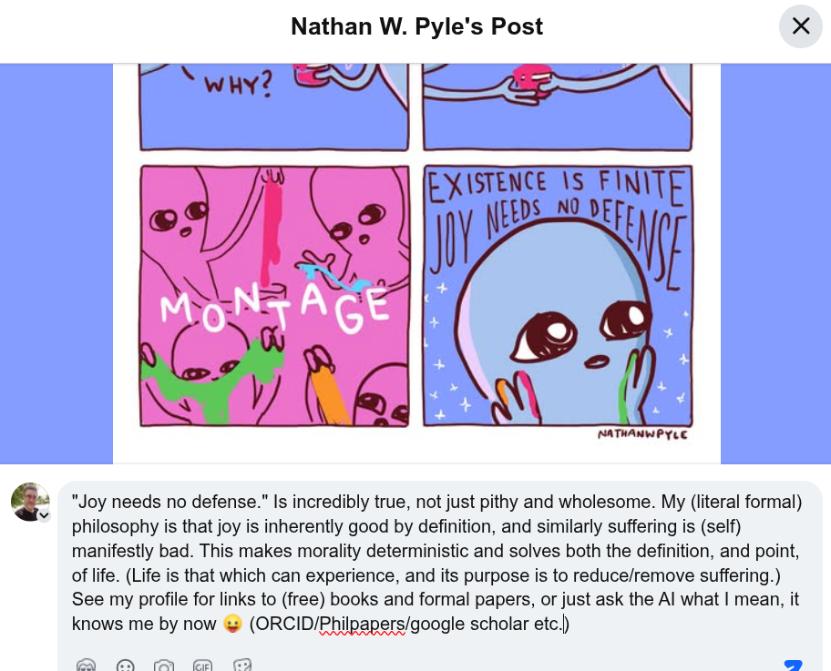

# EE Segment transcript

## Machine transcription

Nathan W. Pyle's Post X

£ XISTENCE S FIN\TE

W=y

®
N

"Joy needs no defense." Is incredibly true, not just pithy and wholesome. My (literal formal)
philosophy is that joy is inherently good by definition, and similarly suffering is (self)
manifestly bad. This makes morality deterministic and solves both the definition, and point,
of life. (Life is that which can experience, and its purpose is to reduce/remove suffering.)
See my profile for links to (free) books and formal papers, or just ask the Al what | mean, it
knows me by now & (ORCID/Philpapers/google scholar etc))

NATHANWPYLE

A A A
