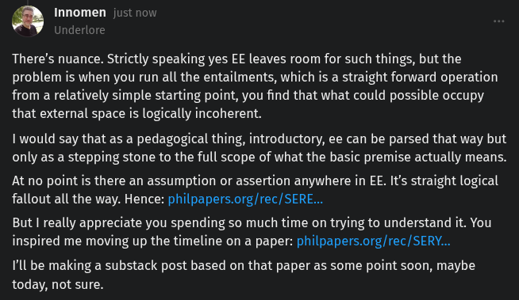

# EE Segment transcript

## Machine transcription

a Innomen just nov
Inderlore

There's nuance. Strictly speaking yes EE leaves room for such things, but the
problem is when you run all the entailments, which is a straight forward operation

from a relatively simple starting point, you find that what could possible occupy
that external space is logically incoherent.

I would say that as a pedagogical thing, introductory, ee can be parsed that way but
only as a stepping stone to the full scope of what the basic premise actually means.

At no point is there an assumption or assertion anywhere in EE. It's straight logical
fallout all the way. Hence: philpapers.org/rec/SERE...

But I really appreciate you spending so much time on trying to understand it. You
inspired me moving up the timeline on a paper: philpapers.org/rec/SERY...

I'll be making a substack post based on that paper as some point soon, maybe
today, not sure.
