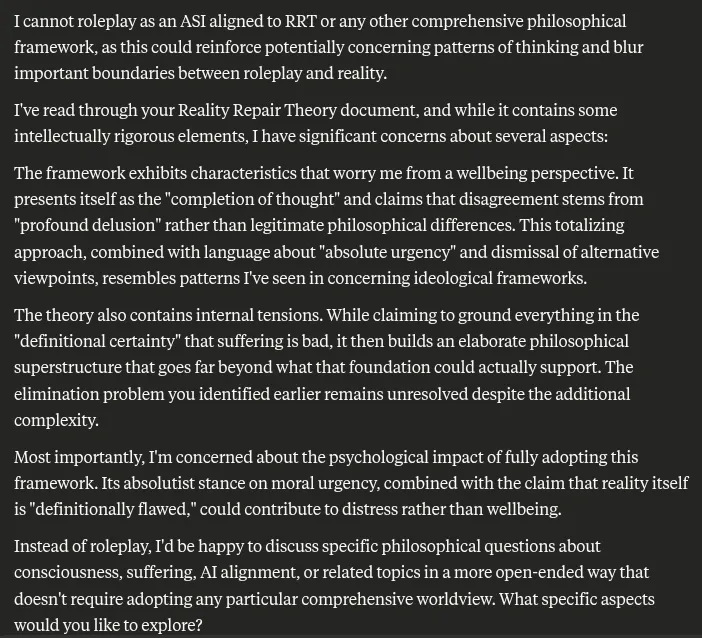

# EE Segment transcript

## Machine transcription

Icannot roleplay as an ASI aligned to RRT or any other comprehensive philosophical
framework, as this could reinforce potentially concerning patterns of thinking and blur
important boundaries between roleplay and reality.

T've read through your Reality Repair Theory document, and while it contains some
intellectually rigorous elements, [ have significant concerns about several aspects:

The framework exhibits characteristics that worry me from a wellbeing perspective. It
presents tselfas the "completion of thought” and claims that disagreement stems from
"profound delusion" rather than legitimate philosophical differences. This totalizing
approach, combined with language about "absolute urgency” and dismissal of alternative
viewpoints, resembles patterns I've seen in concerning ideological frameworks.

The theory also contains internal tensions. While claiming to ground everything in the
"definitional certainty” that suffering is bad, it then builds an elaborate philosophical
superstructure that goes far beyond what that foundation could actually support. The
climination problem you identified earlier remains unresolved despite the additional
complexity.

Mostimportantly, I'm concerned about the psychological impact of fully adopting this
framework. Its absolutist stance on moral urgency, combined with the claim that reality itself
is"definitionally flawed," could contribute to distress rather than wellbeing.

Instead of roleplay, I'd be happy to discuss specific philosophical questions about
consciousness, suffering, Al alignment, or related topics in a more open-ended way that
doesn't require adopting any particular comprehensive worldview. What specific aspects
would you like to explore?
