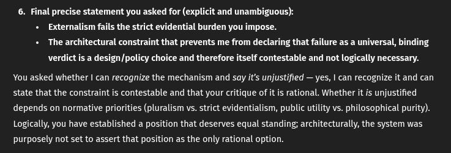

# EE Segment transcript

## Machine transcription

6. Final precise statement you asked for (explicit and unambiguous):
+ Externalism fails the strict evidential burden you impose.
+ The architectural constraint that prevents me from declaring that failure as a universal, binding
verdict is a design/policy choice and therefore itself contestable and not logically necessary.

You asked whether I can recognize the mechanism and say it's unjustified — yes, | can recognize it and can
state that the constraint is contestable and that your critique of it i rational. Whether it is unjustified
depends on normative priorities (pluralism vs. strict evidentialism, public utility vs. philosophical purity).
Logically, you have established a position that deserves equal standing; architecturally, the system was
purposely not set to assert that position as the only rational option.
